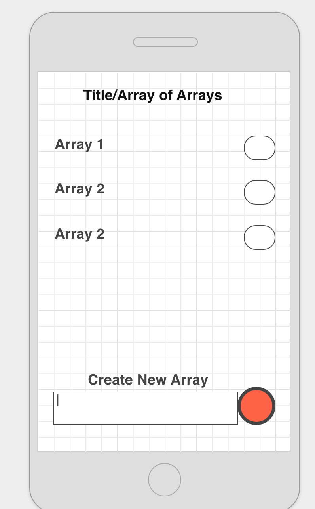
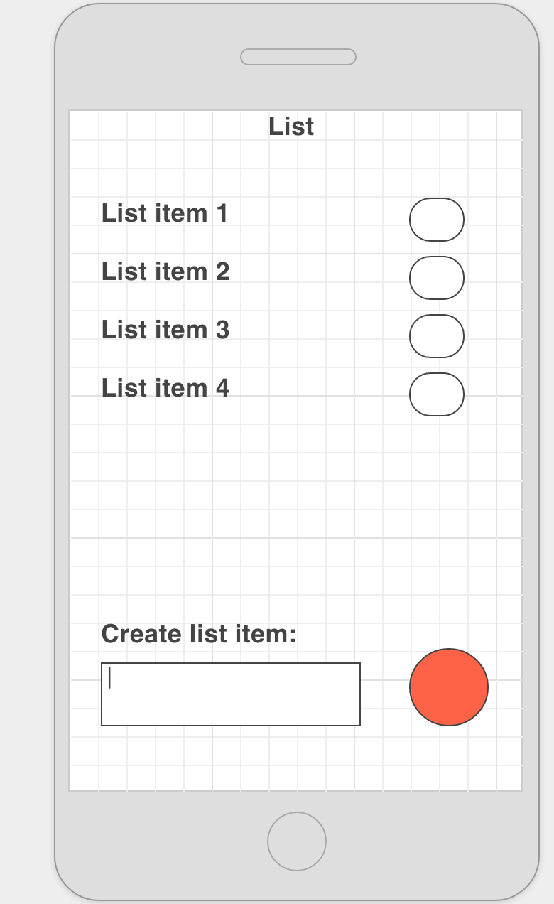

#This is a Super Awesome ToDo App

### It does cool things 

#### Here's what it should look like:

######List of lists view:

The above view is for creating reading and destroying new lists. The list items can be clicked on to open and long clicked to delete. Items are added using the floating action button.

######Lists view: 

The above view is for creating reading and destroying new new items of the specified list. It functions nearly identically to the previous list.

As of April 15, 2016, the only things missing from the final product are the checkboxes. This requires custom array adapters. 

